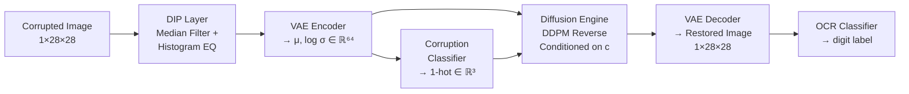
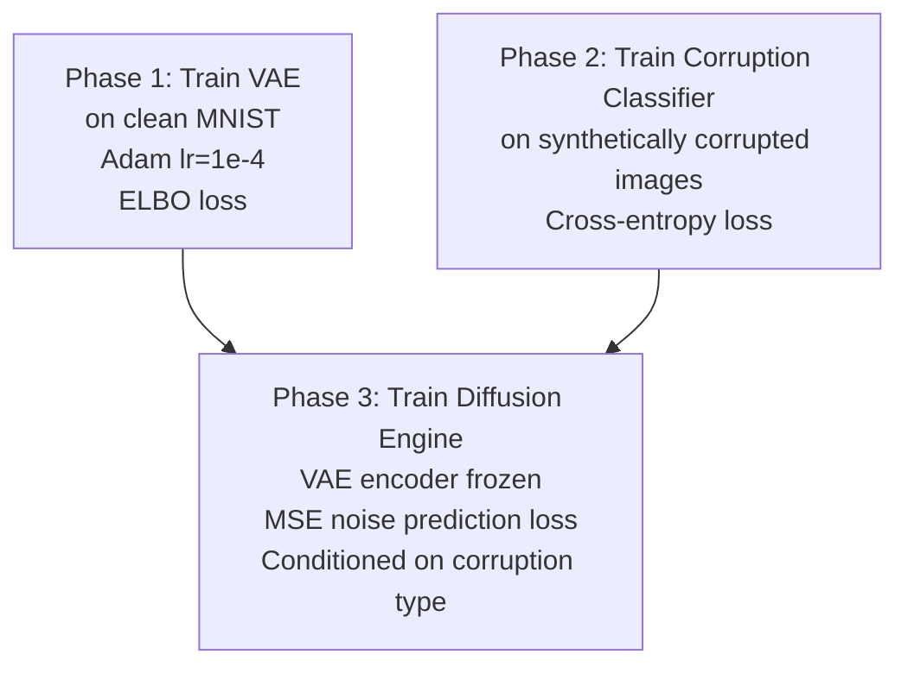
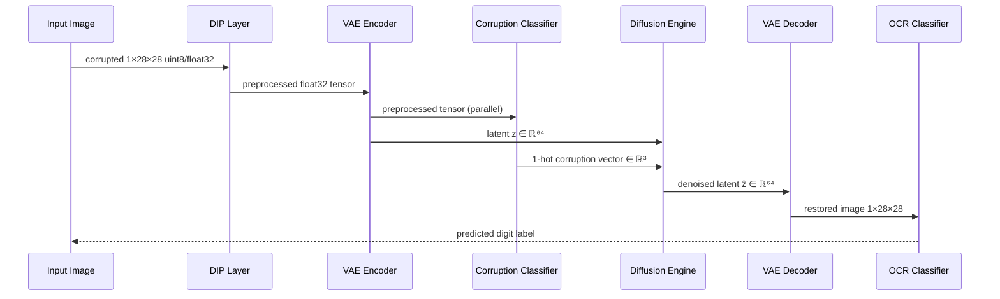

# Design Document: Adaptive Digit Restoration

## Overview

The Adaptive Digit Restoration system is a hybrid AI pipeline that restores corrupted MNIST handwritten digit images to improve downstream OCR accuracy. It chains classical Digital Image Processing (DIP) with a Variational Autoencoder (VAE) and a Conditional Latent Diffusion Model (LDM) operating in DDPM style.

The pipeline processes 1×28×28 grayscale images through five sequential stages:

1. **DIP Preprocessing** — median filter + histogram equalization to stabilize corrupted inputs
2. **VAE Encoding** — compress the preprocessed image into a 64-dimensional latent vector
3. **Corruption Classification** — predict the corruption type (gaussian_noise, motion_blur, spatial_masking) and produce a 1-hot conditioning vector
4. **Conditional LDM Denoising** — iteratively denoise the latent vector, conditioned on the corruption type
5. **VAE Decoding** — reconstruct a 1×28×28 restored image from the denoised latent

Evaluation compares OCR accuracy and PSNR across clean, corrupted, and restored images.

---

## Architecture

### High-Level Pipeline



### Training Phases

Training is split into three independent phases to keep concerns separated:



### Inference Flow



---

## Components and Interfaces

### 1. DistortionEngine (`data/distortion_engine.py`)

Applies synthetic corruptions to clean MNIST images for training data generation and evaluation.

**Interface:**
```python
def apply_distortion(
    image: np.ndarray,
    distortion_type: str,   # "gaussian_noise" | "motion_blur" | "spatial_masking"
    seed: int | None = None
) -> np.ndarray
```

**Behaviour:**
- `gaussian_noise`: additive Gaussian noise, σ ~ Uniform(0.1, 0.5)
- `motion_blur`: convolution with a 3×3 or 5×5 horizontal motion kernel
- `spatial_masking`: zeros out a randomly positioned contiguous 8×8 region
- Raises `ValueError` for unrecognised corruption types
- Accepts optional `seed` for reproducibility

**Design decision:** The existing `apply_distortion` uses keys `"noise"`, `"blur"`, `"mask"`. The requirements specify `"gaussian_noise"`, `"motion_blur"`, `"spatial_masking"`. The implementation must be updated to use the canonical names from the requirements, and the config.yaml `distortion` key updated accordingly.

---

### 2. DIP Layer (`src/preprocessing/dip_filters.py`)

Classical preprocessing applied to corrupted images before VAE encoding.

**Interface:**
```python
def preprocess(image: np.ndarray) -> np.ndarray
```

Internally applies in order:
1. `median_filter(image, kernel_size=3)` — suppresses salt-and-pepper noise
2. `cv2.equalizeHist(...)` — global histogram equalization for contrast normalisation

Returns a NumPy array of the same spatial dimensions as the input, dtype uint8 or float32.

**Design decision:** `dip_filters.py` already has `median_filter`. A `preprocess` convenience function that chains median filter → histogram equalization needs to be added. The existing `apply_filter` dispatcher is kept for individual filter access.

---

### 3. VAE (`src/models/vae.py`)

Encodes 1×28×28 images into a 64-dimensional latent space and decodes latent vectors back to images.

**Encoder architecture:**
```
Input: (B, 1, 28, 28)
Conv2d(1→32, k=3, stride=2, pad=1)  → (B, 32, 14, 14)
ReLU
Conv2d(32→64, k=3, stride=2, pad=1) → (B, 64, 7, 7)
ReLU
Flatten → (B, 3136)
Linear(3136 → 64) → μ
Linear(3136 → 64) → log σ
```

**Decoder architecture:**
```
Input: z ∈ (B, 64)
Linear(64 → 3136) → reshape (B, 64, 7, 7)
ConvTranspose2d(64→32, k=4, stride=2, pad=1) → (B, 32, 14, 14)
ReLU
ConvTranspose2d(32→1, k=4, stride=2, pad=1)  → (B, 1, 28, 28)
Sigmoid
```

**Loss:** ELBO = BCE(recon, x, reduction="sum") + β·KL, where KL = −0.5·Σ(1 + log σ − μ² − σ²)

**Interface:**
```python
class VAE(nn.Module):
    def forward(self, x) -> tuple[Tensor, Tensor, Tensor]  # recon, mu, logvar
    def encode(self, x) -> tuple[Tensor, Tensor]           # mu, logvar
    def decode(self, z) -> Tensor                          # reconstructed image
    @staticmethod
    def loss(recon_x, x, mu, logvar) -> Tensor
```

**Freezing:** During diffusion training, `vae.encoder.requires_grad_(False)` is called.

---

### 4. Corruption Classifier (`src/models/ocr_classifier.py` extended or new `corruption_classifier.py`)

A lightweight CNN that predicts the corruption type from a preprocessed image.

**Architecture:**
```
Input: (B, 1, 28, 28)
Conv2d(1→32, k=3, pad=1) → ReLU → MaxPool2d(2)  → (B, 32, 14, 14)
Conv2d(32→64, k=3, pad=1) → ReLU → MaxPool2d(2) → (B, 64, 7, 7)
Flatten → Linear(3136→128) → ReLU → Dropout(0.3)
Linear(128→3) → softmax probabilities
```

**Interface:**
```python
class CorruptionClassifier(nn.Module):
    def forward(self, x: Tensor) -> Tensor          # (B, 3) probabilities
    def predict_onehot(self, x: Tensor) -> Tensor   # (B, 3) 1-hot vector
```

**Design decision:** The existing `OCRClassifier` has the same backbone shape. `CorruptionClassifier` is a separate class with `num_classes=3` to keep concerns decoupled. It lives in `src/models/corruption_classifier.py`.

---

### 5. Diffusion Engine (`src/core/diffusion_engine.py`)

DDPM-style LDM operating in the VAE latent space, conditioned on corruption type.

**Forward process (training):**
```
z₀ ~ VAE.encode(x)
t ~ Uniform(0, T)
ε ~ N(0, I)
z_t = √ᾱ_t · z₀ + √(1−ᾱ_t) · ε
loss = MSE(UNet(z_t, t, c), ε)
```

**Reverse process (inference):**
```
z_T ~ N(0, I)
for t = T, T-1, ..., 1:
    ε̂ = UNet(z_t, t, c)
    z_{t-1} = (1/√α_t)(z_t − (1−α_t)/√(1−ᾱ_t) · ε̂) + √β_t · ε
return z_0
```

**Noise schedule:** linear, β₁ = 1e-4, β_T = 0.02, T = 1000 (configurable)

**Conditioning:** The 1-hot corruption vector `c ∈ ℝ³` is concatenated with the noisy latent before passing to the UNet, or injected via a conditioning projection layer.

**Interface:**
```python
class DiffusionEngine:
    def forward_process(self, z0, t) -> tuple[Tensor, Tensor]   # z_t, noise
    def reverse_process(self, z_t, c) -> Tensor                 # denoised z_0
    def compute_loss(self, z0, c) -> Tensor                     # MSE loss
```

---

### 6. UNet (`src/models/unet.py`)

Noise prediction backbone for the diffusion engine. Accepts noisy latent + timestep + corruption conditioning.

**Current state:** The existing UNet operates on 28×28 spatial tensors with timestep embedding. It needs to be extended to accept the 3-dimensional corruption conditioning vector.

**Conditioning injection strategy:** A `ConditioningEmbedding` projects the 3-dim 1-hot vector to `t_dim=64` dimensions and adds it to the timestep embedding before injection into each `ConvBlock`. This avoids changing the UNet's spatial input shape.

```python
class ConditioningEmbedding(nn.Module):
    def __init__(self, cond_dim=3, t_dim=64):
        self.proj = nn.Sequential(nn.Linear(cond_dim, t_dim), nn.SiLU())
```

The combined embedding `t_emb + cond_emb` is passed to each `ConvBlock.t_proj`.

**Design decision:** Injecting conditioning through the time embedding pathway is the minimal change to the existing UNet. An alternative (channel concatenation at input) would require changing `in_channels` and all downstream channel counts — more invasive.

---

### 7. OCR Classifier (`src/models/ocr_classifier.py`)

Pre-trained CNN for digit recognition. Used only for evaluation — never updated during restoration training.

**Interface:**
```python
class OCRClassifier(nn.Module):
    def forward(self, x: Tensor) -> Tensor    # (B, 10) logits
    def predict(self, x: Tensor) -> Tensor    # (B,) class indices
```

---

### 8. Pipeline Orchestrator (`main.py`)

Coordinates all stages for inference and evaluation.

**Interface:**
```python
def run_pipeline(cfg: dict) -> dict   # returns metrics dict
```

Responsibilities:
- Load model checkpoints from paths in `cfg`
- Raise `FileNotFoundError` if a checkpoint is missing
- Select device (CUDA if available, else CPU)
- Log each stage name and output tensor shape at INFO level
- Return `{A_clean, A_corrupted, A_restored, mean_psnr, mean_elbo}`

---

### 9. Evaluation Module (`experiments/baseline_ocr_eval.py` + new `src/utils/metrics.py`)

**`src/utils/metrics.py`** — pure functions for metric computation:
```python
def compute_psnr(restored: Tensor, clean: Tensor) -> float
def compute_elbo(vae: VAE, images: Tensor) -> float
def compute_ocr_accuracy(ocr: OCRClassifier, images: Tensor, labels: Tensor) -> float
```

**`experiments/baseline_ocr_eval.py`** — extended to:
- Evaluate OCR on all three corruption types independently
- Write results to JSON/CSV at path from config

---

### 10. Configuration (`src/utils/config.py` + `config.yaml`)

`load_config` merges user YAML over defaults. Missing required keys raise `KeyError`. Random seed is applied to `torch`, `numpy`, and `random` at startup.

**Updated `config.yaml` schema:**
```yaml
data:
  raw_dir: data/raw
  processed_dir: data/processed
  distortion: gaussian_noise   # gaussian_noise | motion_blur | spatial_masking
  seed: 42

preprocessing:
  filter: median
  kernel_size: 3

vae:
  latent_dim: 64
  beta: 1.0
  epochs: 20
  lr: 1.0e-4
  checkpoint: checkpoints/vae.pth

corruption_classifier:
  epochs: 15
  lr: 1.0e-4
  checkpoint: checkpoints/corruption_classifier.pth

diffusion:
  timesteps: 1000
  beta_start: 1.0e-4
  beta_end: 0.02
  epochs: 30
  lr: 1.0e-4
  checkpoint: checkpoints/diffusion.pth

ocr:
  epochs: 10
  lr: 1.0e-3
  checkpoint: checkpoints/ocr.pth

evaluation:
  output_path: experiments/results/eval_report.json

device: cuda
seed: 42
```

---

## Data Models

### Image Tensor

| Field | Type | Shape | Range |
|---|---|---|---|
| clean_image | `torch.Tensor` | (B, 1, 28, 28) | [0, 1] float32 |
| corrupted_image | `torch.Tensor` | (B, 1, 28, 28) | [0, 1] float32 |
| preprocessed_image | `np.ndarray` | (28, 28) | [0, 255] uint8 |
| restored_image | `torch.Tensor` | (B, 1, 28, 28) | [0, 1] float32 |

### Latent Vector

| Field | Type | Shape | Description |
|---|---|---|---|
| mu | `torch.Tensor` | (B, 64) | VAE encoder mean |
| logvar | `torch.Tensor` | (B, 64) | VAE encoder log-variance |
| z | `torch.Tensor` | (B, 64) | Reparameterized sample |
| z_t | `torch.Tensor` | (B, 64) | Noisy latent at timestep t |

### Corruption Conditioning

| Field | Type | Shape | Values |
|---|---|---|---|
| corruption_type | `str` | — | `"gaussian_noise"`, `"motion_blur"`, `"spatial_masking"` |
| corruption_probs | `torch.Tensor` | (B, 3) | Softmax probabilities |
| corruption_onehot | `torch.Tensor` | (B, 3) | 1-hot encoded class |

### Evaluation Report

```python
@dataclass
class EvalReport:
    a_clean: float          # OCR accuracy on clean images
    a_corrupted: dict       # {corruption_type: accuracy}
    a_restored: dict        # {corruption_type: accuracy}
    mean_psnr: dict         # {corruption_type: psnr_db}
    mean_elbo: float        # VAE ELBO on clean images
```

### Checkpoint Files

All model weights are saved as PyTorch state dicts:

| Model | Default Path |
|---|---|
| VAE | `checkpoints/vae.pth` |
| CorruptionClassifier | `checkpoints/corruption_classifier.pth` |
| DiffusionEngine (UNet) | `checkpoints/diffusion.pth` |
| OCRClassifier | `checkpoints/ocr.pth` |

---

## Correctness Properties

*A property is a characteristic or behavior that should hold true across all valid executions of a system — essentially, a formal statement about what the system should do. Properties serve as the bridge between human-readable specifications and machine-verifiable correctness guarantees.*

Property-based testing is applicable here because the pipeline contains pure functions (distortion, DIP preprocessing, VAE encode/decode, noise schedule math, metric computation) with well-defined input/output behavior and universal properties that hold across a wide input space. The property-based testing library used is **Hypothesis** (Python).

---

### Property 1: Distortion preserves image shape

*For any* grayscale image array and any valid corruption type (`gaussian_noise`, `motion_blur`, `spatial_masking`), the output of `apply_distortion` shall have the same spatial shape as the input.

**Validates: Requirements 1.4**

---

### Property 2: Distortion reproducibility with seed

*For any* clean image and any integer seed value, calling `apply_distortion` twice with the same seed and corruption type shall return byte-identical NumPy arrays.

**Validates: Requirements 1.6, 9.4**

---

### Property 3: Spatial masking zeros exactly one 8×8 contiguous block

*For any* clean image corrupted with `spatial_masking`, the output shall contain exactly 64 zero-valued pixels that form a contiguous 8×8 rectangular region, and all pixels outside that region shall be unchanged.

**Validates: Requirements 1.3**

---

### Property 4: DIP preprocessing preserves spatial dimensions

*For any* input image (uint8 or float32, any valid pixel values), the output of the DIP `preprocess` function shall have the same spatial dimensions (height × width) as the input.

**Validates: Requirements 2.4**

---

### Property 5: VAE encode-decode shape invariant

*For any* batch of 1×28×28 float32 tensors, the VAE encoder shall produce `(mu, logvar)` each of shape `(B, 64)`, and the VAE decoder shall produce a tensor of shape `(B, 1, 28, 28)` with all pixel values in [0, 1].

**Validates: Requirements 3.1, 3.4**

---

### Property 6: Corruption classifier output is a valid probability distribution

*For any* batch of 1×28×28 input tensors (including random noise, all-zeros, all-ones), `CorruptionClassifier.forward` shall return a `(B, 3)` tensor where each row sums to 1.0 (within floating-point tolerance) and all values are in [0, 1], and `predict_onehot` shall return a `(B, 3)` tensor where each row contains exactly one 1 and two 0s.

**Validates: Requirements 4.1, 4.2, 4.4**

---

### Property 7: DDPM forward process produces correctly scaled noisy latents

*For any* latent vector `z0` and any timestep `t ∈ [0, T)`, the noisy latent `z_t` produced by the forward process shall satisfy: `E[z_t] ≈ √ᾱ_t · z0` and `Var[z_t] ≈ (1 − ᾱ_t)`, confirming the linear noise schedule is applied correctly.

**Validates: Requirements 5.1**

---

### Property 8: Diffusion reverse process output shape

*For any* noisy latent `z_T` of shape `(B, 64)` and any 1-hot conditioning vector of shape `(B, 3)`, `DiffusionEngine.reverse_process` shall return a tensor of shape `(B, 64)`.

**Validates: Requirements 5.6**

---

### Property 9: VAE encoder remains frozen during diffusion training

*For any* training batch, after calling `compute_loss` and `loss.backward()` on the `DiffusionEngine`, the parameter values of the frozen VAE encoder shall be identical to their values before the backward pass.

**Validates: Requirements 5.5**

---

### Property 10: Pipeline output shape matches input batch size

*For any* batch of `B` corrupted 1×28×28 images passed through the full restoration pipeline, the output shall be a batch of `B` restored images of shape `(B, 1, 28, 28)` with pixel values in [0, 1].

**Validates: Requirements 6.2**

---

### Property 11: PSNR is finite and positive for non-identical images

*For any* pair of restored and clean images with the same shape, `compute_psnr` shall return a finite positive float value in dB. For identical images, it shall return a value indicating perfect reconstruction (infinity or a sentinel large value).

**Validates: Requirements 7.3**

---

### Property 12: Evaluation report contains all required fields

*For any* evaluation run over any batch of images, the returned `EvalReport` shall contain all required fields (`a_clean`, `a_corrupted`, `a_restored`, `mean_psnr`, `mean_elbo`) with finite numeric values.

**Validates: Requirements 7.5**

---

### Property 13: Seed reproducibility across full pipeline

*For any* integer seed value, two independent runs of the pipeline with the same seed and same input shall produce byte-identical output tensors.

**Validates: Requirements 9.4**

---

## Error Handling

### Missing Checkpoint Files

When the pipeline loads model weights, it checks each configured path before attempting to load:

```python
if not Path(checkpoint_path).exists():
    raise FileNotFoundError(f"Checkpoint not found: {checkpoint_path}")
```

This applies to all four model checkpoints (VAE, CorruptionClassifier, DiffusionEngine, OCRClassifier).

### Invalid Corruption Type

`apply_distortion` raises `ValueError` with a descriptive message listing valid options:

```python
raise ValueError(
    f"Unknown corruption type '{distortion_type}'. "
    f"Valid options: {list(VALID_TYPES)}"
)
```

### Missing Configuration Keys

`load_config` validates required keys after merging user config over defaults. Missing required keys raise `KeyError`:

```python
raise KeyError(f"Required configuration key missing: '{key}'")
```

Required keys: `data.raw_dir`, `vae.latent_dim`, `diffusion.timesteps`, `diffusion.beta_start`, `diffusion.beta_end`.

### Device Fallback

If `device: cuda` is configured but CUDA is unavailable, the pipeline logs a warning and falls back to CPU:

```python
if cfg["device"] == "cuda" and not torch.cuda.is_available():
    logger.warning("CUDA not available, falling back to CPU.")
    device = "cpu"
```

### VAE Decoder Output Clamping

The VAE decoder ends with `Sigmoid`, so outputs are naturally in [0, 1]. No explicit clamping is needed, but downstream code should not assume exact 0/1 boundaries.

### Batch Size Consistency

The pipeline validates that all stage outputs maintain the input batch size `B`. If a shape mismatch is detected, a `RuntimeError` is raised with the stage name and observed shapes.

---

## Testing Strategy

### Dual Testing Approach

Both unit/example-based tests and property-based tests are used:

- **Unit tests** cover specific examples, integration points, error conditions, and architectural constraints
- **Property tests** verify universal properties across randomly generated inputs using **Hypothesis**

### Property-Based Testing Configuration

- Library: `hypothesis` with `hypothesis[numpy]` for array strategies
- Minimum iterations: 100 per property test (`settings(max_examples=100)`)
- Each property test is tagged with a comment referencing the design property:
  ```python
  # Feature: adaptive-digit-restoration, Property 1: Distortion preserves image shape
  ```

### Test File Structure

```
tests/
  unit/
    test_distortion_engine.py     # Properties 1, 2, 3 + error cases
    test_dip_filters.py           # Property 4 + ordering example
    test_vae.py                   # Property 5 + architecture examples
    test_corruption_classifier.py # Property 6 + accuracy smoke
    test_diffusion_engine.py      # Properties 7, 8, 9
    test_pipeline.py              # Properties 10, 13 + integration examples
    test_metrics.py               # Properties 11, 12
    test_config.py                # Error cases for missing keys
  integration/
    test_baseline_eval.py         # Baseline evaluation output structure
    test_full_pipeline.py         # End-to-end smoke test with trained weights
```

### Unit Test Coverage

| Component | Test Type | What's Verified |
|---|---|---|
| DistortionEngine | Property | Shape preservation, seed reproducibility, masking structure |
| DistortionEngine | Edge case | ValueError on invalid type |
| DIP Layer | Property | Shape preservation |
| DIP Layer | Example | Ordering (median before equalize), dtype compatibility |
| VAE | Property | Encode/decode shapes and value range |
| VAE | Example | Architecture (3 stride-2 convs), loss formula, freezing |
| CorruptionClassifier | Property | Valid probability distribution, 1-hot output |
| DiffusionEngine | Property | Forward process statistics, output shape, frozen encoder |
| DiffusionEngine | Example | Configurable T, loss formula |
| Pipeline | Property | Batch shape preservation, seed reproducibility |
| Pipeline | Edge case | FileNotFoundError on missing checkpoint |
| Metrics | Property | PSNR correctness, report completeness |
| Config | Edge case | KeyError on missing required key |

### Integration Tests

Integration tests run the full pipeline with small synthetic data (no real MNIST download required) to verify end-to-end wiring:

- Baseline evaluation script produces correctly structured JSON output
- Pipeline stages are called in the correct order (verified with mocks)
- Evaluation report is written to the configured file path

### Smoke Tests (Post-Training)

After model training completes:

- VAE achieves PSNR ≥ 20 dB on MNIST test set
- CorruptionClassifier achieves ≥ 85% accuracy on held-out corrupted images
- A_restored > A_corrupted for all three corruption types
- Mean PSNR of restored images > mean PSNR of corrupted images for all three corruption types
